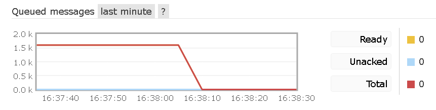
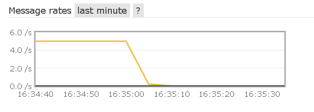

# Description
This is PoC about [KEDA](https://keda.sh/).

> KEDA is a Kubernetes-based Event Driven Autoscaler. With KEDA, you can drive the scaling of any container in Kubernetes based on the number of events needing to be processed.

We are going to queue some messages over a RabbitMQ, and scale a consumer deployment based on number of elements inside the queue.

# Consumer and Producer
I have used [Apache Camel](https://camel.apache.org/) for both, consumer and producer. 
## How to generate Apache Camel Spring Boot project
[Apache Camel Maven Archetypes](https://camel.apache.org/manual/latest/camel-maven-archetypes.html)

[How to create a new Spring based Apache Camel route](https://camel.apache.org/manual/latest/creating-a-new-spring-based-camel-route.html)

```bash
mvn archetype:generate -DarchetypeGroupId=org.apache.camel.archetypes -DarchetypeArtifactId=camel-archetype-spring-boot -DarchetypeVersion=3.10.0 -DgroupId=keda.poc -DartifactId=producer -Dversion=0.0.1-SNAPSHOT
```
## Docker images
I have also used [Fabric8 Docker Maven plugin](https://dmp.fabric8.io/) to generate its images. So as to load them in the kubernetes cluster. Check `pom.xml` for more details.

```bash
mvn clean package
...
[INFO] --- docker-maven-plugin:0.35.0:build (build-image) @ consumer ---
[INFO] Copying files to \keda-poc\producerAndConsumer\consumer\target\docker\consumer\build\jar
[INFO] Building tar: \keda-poc\producerAndConsumer\consumer\target\docker\consumer\tmp\docker-build.tar
[INFO] DOCKER> [consumer:latest]: Created docker-build.tar in 5 seconds
[INFO] DOCKER> [consumer:latest]: Built image sha256:ae47b
[INFO] DOCKER> [consumer:latest]: Removed old image sha256:95593
[INFO] DOCKER> [consumer:latest]: Tag with latest,0.0.1-SNAPSHOT
[INFO] DOCKER> Tagging image consumer:latest successful!
[INFO] DOCKER> Tagging image consumer:0.0.1-SNAPSHOT successful!
```

# Kubernetes stuff
## Init Kubernetes cluster
I am going to use [kind](https://kind.sigs.k8s.io/)
```
kind create cluster --name keda-poc
```

## Deploying KEDA
[Deploying with Helm](https://keda.sh/docs/2.3/deploy/#helm)  

## Loading consumer and producer images into kind cluster.
After a successful `mvn clean package`
```
kind load docker-image producer:0.0.1-SNAPSHOT --name keda-poc
kind load docker-image consumer:0.0.1-SNAPSHOT --name keda-poc
```
## Troubleshooting KEDA
* [KEDA operator](https://keda.sh/docs/1.4/concepts/troubleshooting/#keda-logging-and-telemetry)

* If you cannot connect to your rabbitMQ from KEDA, https://github.com/kedacore/keda/issues/879

## Producer and consumer
### RabbitMQ
```
kubectl apply -f k8/rabbitmq.yaml
```
There are some RabbitMQ operators/helms avaiable on the internet, but I have decided to use a custom one.
### Producer
```
kubectl apply -f k8/producer.yaml
```
This will start some producers. RabbitMQ `foo` will start to enqueue some messages

### Consumer
```
kubectl apply -f k8/consumer.yaml
```
This will create a consumer deployment starting with `0` pods

### Keda
```
kubctl -f apply -f k8/keda.yaml
```

There are 5 providers and 0 consumers, so over time, number of messages will start to increase

KEDA will start to scale up the number of pods inside `consumer-deployment`

**Note** I will omit producer and rabbitMQ pods

```bash
kubectl get pods
NAME                                   READY   STATUS    RESTARTS   AGE
```
```
kubectl get pods
NAME                                   READY   STATUS    RESTARTS   AGE
consumer-deployment-dc577c54-85qr6     1/1     Running   0          6s
consumer-deployment-dc577c54-bppd9     1/1     Running   0          16s
```
```
kubectl get pods
NAME                                   READY   STATUS    RESTARTS   AGE
consumer-deployment-dc577c54-85qr6     1/1     Running   0          38s
consumer-deployment-dc577c54-bppd9     1/1     Running   0          48s
consumer-deployment-dc577c54-bzxgn     1/1     Running   0          23s
consumer-deployment-dc577c54-cmbw6     1/1     Running   0          8s
consumer-deployment-dc577c54-fcgkt     1/1     Running   0          23s
```

KEDA will scale up `consumers` until they are able to finish all pending jobs.


After all messages have been processed, consumers are no longer needed so KEDA will kill the pods
```
kubectl get pods
NAME                                  READY   STATUS    RESTARTS   AGE
```

**Note** some RabbitMQ Stuff from the management console
```
kubectl scale --replicas=0 deployment/producer-deployment
```

